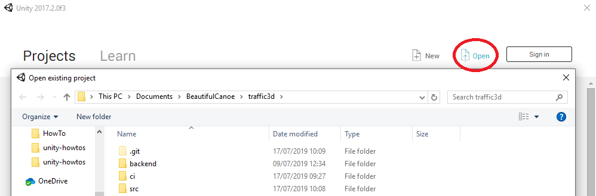
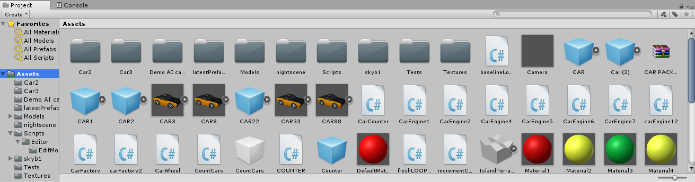
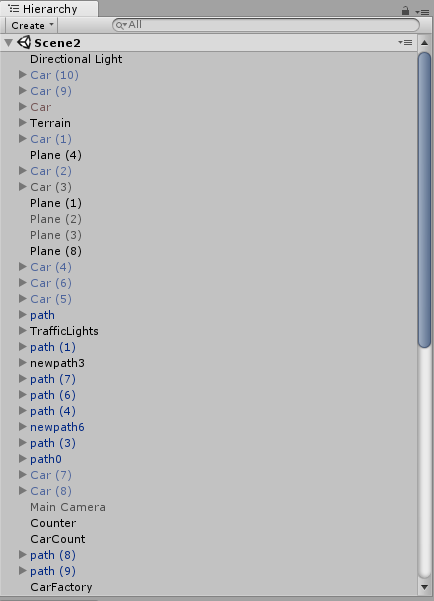
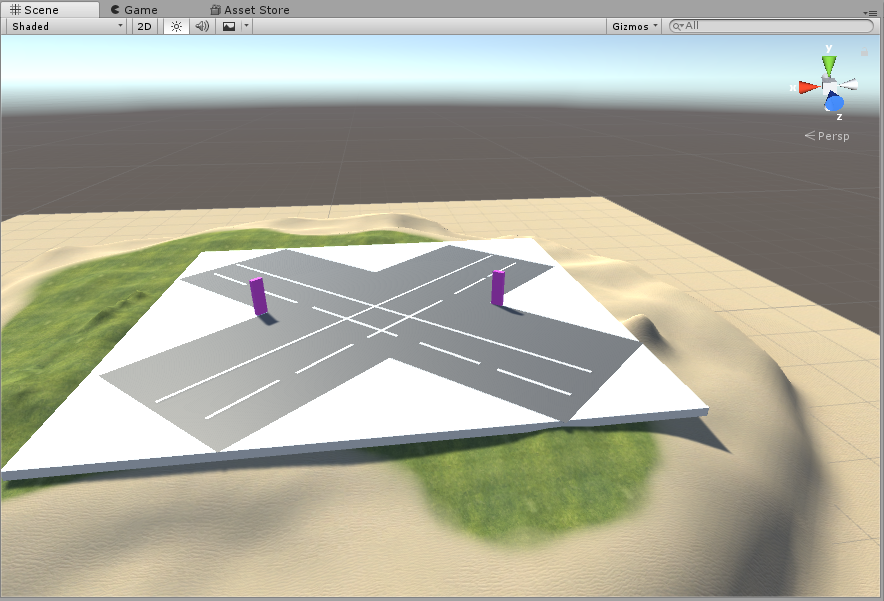
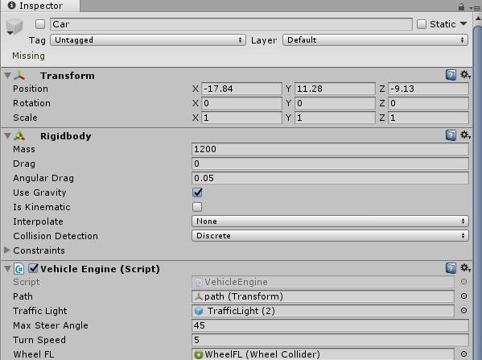
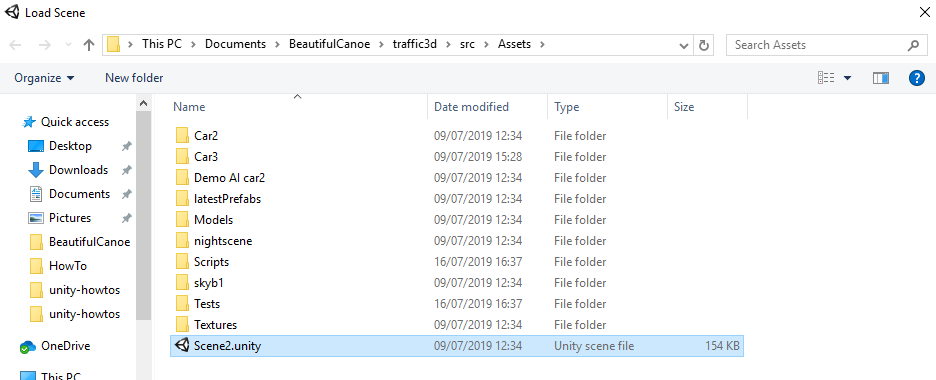
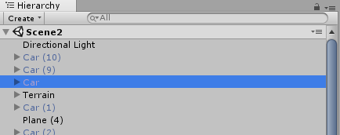
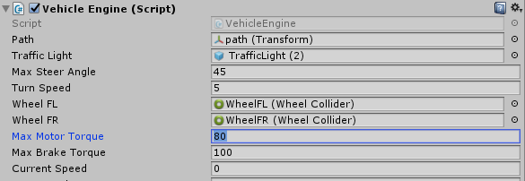

# Contributing to the Traffic 3D project

## Technologies

This project is based on the [Unity 3d games engine](https://unity3d.com/unity).

## Getting started

### Clone this repository

From the command line, run:

```sh
git clone git@gitlab.com:beautifulcanoe/developers/traffic3d.git
cd traffic3d
```

### Installation and set-up

The project runs on Unity 2017.2.0f1 and up.
Download the latest of Unity from the following link: [https://unity3d.com/get-unity/download/](https://unity3d.com/get-unity/download/)
Or download Unity 2017.2.0f1 from the following link: [https://unity3d.com/get-unity/download/archive](https://unity3d.com/get-unity/download/archive)

Use a preferred C# IDE or download Visual Studio using the following link: [https://visualstudio.microsoft.com/vs/](https://visualstudio.microsoft.com/vs/)

## Working with Unity

### Open the project

Open Unity and press the open button as shown below.



Navigate to the location of the project select the folder that is the parent folder of both the `Assets` and `ProjectSettings` folder.

### Quick Unity Overview

#### Project Window

All `Assets` can be access in this area.
This includes scripts and models for the simulation.



#### Hierarchy Window

The scenes `assets` are listed here, each object may have a child object depending on the `Asset`.



#### Scene Window

Displays the scene and objects within that scene.
Moving around the scene can be done by holding right-click, turning the mouse and using `W` (forward) `S` (backward) `A` (left) and `D` (right).



#### Inspector Window

Once an object has been clicked from either the scene or the hierarchy window, the **Inspector** window will show all the properties of that object.



### Open a scene

In the navigation bar click on **File > Open Scene** and then click on the scene to open.
Scene files have the extension `.unity`.
The scene should then open into the **Scene** window.



### Edit Properties

Navigate to the **Hierarchy** window and click on the object that needs to have its values changed.
As an example, car has been selected below.



The **inspector** window then has the object’s properties which can be changed by clicking on the field and typing in the new value.
For fields with an object as a value, click on the circle icon to the right of the field and select the new object for the field.



## Working with the Python backend

This code comes with a model generator, which generates stochastic events for the simulation.
The model generator is written in Python3 and can be found in the [backend](/backend) directory.

To use it, first install the requirements in a [Python virtual environment](https://docs.python-guide.org/dev/virtualenvs/).

```sh
sudo apt-get install python-virtualenv
cd backend
virtualenv --python=/usr/bin/python3.7 venv
. venv/bin/activate
pip install -r requirements.txt
```

Then run the code, which will listen for a socket from the Unity application:

```sh
$ python model_generator.py
waiting for tcpConnection
```

## Testing

### Creating or Editing Tests

For Unity, there are two testing methods; *Play Mode* and *Edit Mode*.
Edit mode tests are in the following folder:

```sh
/Assets/Scripts/Editor/EditModeTests/
```

Play mode tests are in the following folder:

```sh
/Assets/Tests/
```

To create a test script, navigate to the corresponding folder and right-click in the project window (normally at the bottom of the screen).
Go to **Create > Testing > (Test Mode) Test C# Script**.
This will create script in that directory and simply double click to edit the script.

## Running Tests

Tests can be run within the Unity UI directly.

1. Click **Window** on the top navigation bar.
1. Click **Test Runner**.
1. Click on **PlayMode** and then **Run All**.
1. Click on **EditMode** and then **Run All**.

## Building the Project

It is possible to quickly build the project from the UI if needed.
If a preview is needed, click on the Play button at the top of the screen.
Make sure to un-click the **Play** button if any more edits are needed,
when the play button is selected all changes during that time are reverted.

For a full build, navigate to the top bar and click **File > Build & Run**,
select the folder for the build.
This should create a `.exe` and will automatically execute the `.exe` to play the simulation.
