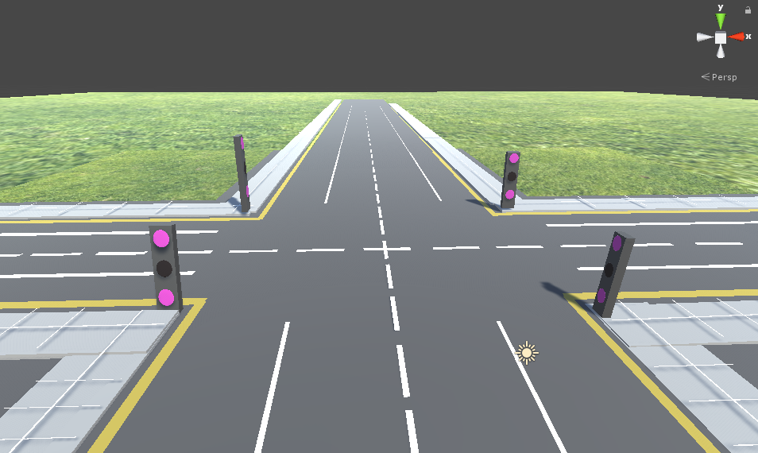
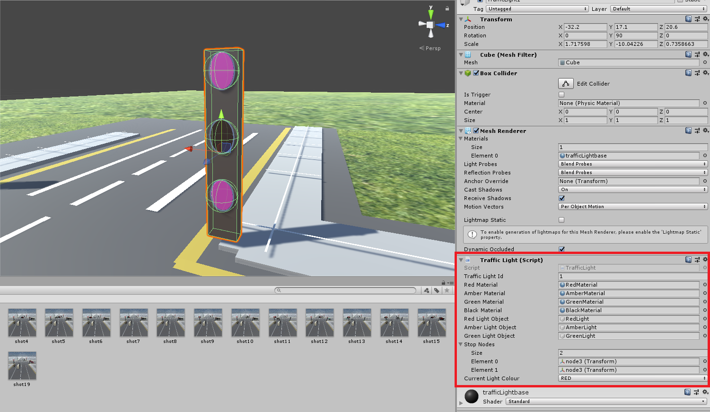
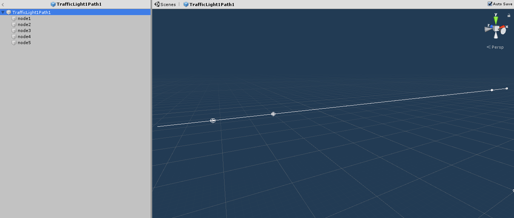
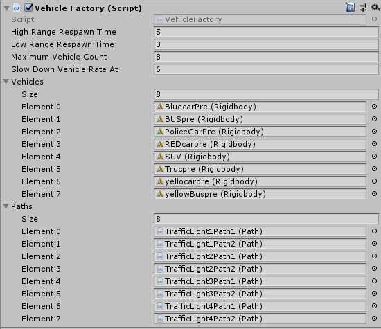
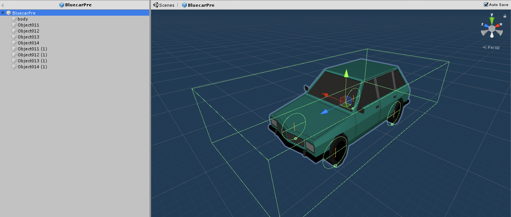
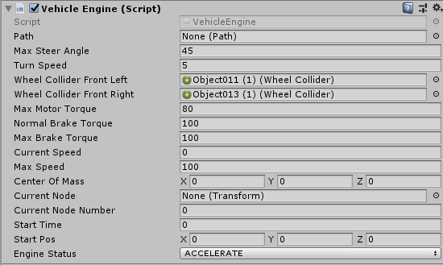

# Contributing to the Traffic 3D project

## Technologies

This project is based on the [Unity 3d games engine](https://unity3d.com/unity).

## Getting started

### Clone this repository

From the command line, run:

```sh
git clone git@gitlab.com:beautifulcanoe/developers/traffic3d.git
cd traffic3d
```

### Installation and set-up

The project runs on Unity 2018.3.11f1 and up.
Download the latest of Unity from the following link: [https://unity3d.com/get-unity/download/](https://unity3d.com/get-unity/download/)
Or download Unity 2018.3.11f1 from the following link: [https://unity3d.com/get-unity/download/archive](https://unity3d.com/get-unity/download/archive)

Use a preferred C# IDE or download Visual Studio using the following link: [https://visualstudio.microsoft.com/vs/](https://visualstudio.microsoft.com/vs/)

## Working with Unity

### Open the project

Open Unity and press the open button as shown below.


Navigate to the location of the project select the folder that is the parent folder of both the `Assets` and `ProjectSettings` folder.

### Quick Unity Overview

#### Project Window

All `Assets` can be access in this area.
This includes scripts and models for the simulation.


#### Hierarchy Window

The scenes `assets` are listed here, each object may have a child object depending on the `Asset`.


#### Scene Window

Displays the scene and objects within that scene.
Moving around the scene can be done by holding right-click, turning the mouse and using `W` (forward) `S` (backward) `A` (left) and `D` (right).


#### Inspector Window

Once an object has been clicked from either the scene or the hierarchy window, the **Inspector** window will show all the properties of that object.


### Open a scene

In the navigation bar click on **File > Open Scene** and then click on the scene to open.
Scene files have the extension `.unity`.
The scene should then open into the **Scene** window.


### Edit Properties

Navigate to the **Hierarchy** window and click on the object that needs to have its values changed.
As an example, car has been selected below.


The **inspector** window then has the object’s properties which can be changed by clicking on the field and typing in the new value.
For fields with an object as a value, click on the circle icon to the right of the field and select the new object for the field.


## Working with the Python3 model generator

This code comes with a model generator, which generates stochastic events for the simulation.
The model generator is written in Python3 and can be found in the [backend](/backend) directory.

To use it, first install the requirements in a [Python virtual environment](https://docs.python-guide.org/dev/virtualenvs/).

```sh
sudo apt-get install python-virtualenv
cd backend
virtualenv --python=/usr/bin/python3.7 venv
. venv/bin/activate
pip install -r requirements.txt
```

If **Windows** is being used then use the following link to download **PyTorch**:
[https://pytorch.org/](https://pytorch.org/)

Otherwise run the following command:

```sh
pip install torch==1.1.0
```

Then run the code, which will listen for a socket from the Unity application:

```sh
$ python traffic3d_processor.py
waiting for tcpConnection
```

### Using PyCharm

[PyCharm](https://www.jetbrains.com/pycharm/) is an IDE for Python can be used to setup the backend easily.
It automatically installs the virtual environment.

1. Open up the `backend` folder as a project.
1. In settings `Ctrl+Alt+S`, `project: backend` > `project interpreter`, press the cog and press `Add...`
1. Press `Ok` and `Apply`
1. By using the `Terminal` in the bottom left of the screen, install requirements.txt and torch.
1. The Terminal can then be used to run `python traffic3d_processor.py`.

PyCharm can also be used to debug the script by using breakpoints if needed.

More information about PyCharm can be found here: [https://www.jetbrains.com/help/pycharm/meet-pycharm.html](https://www.jetbrains.com/help/pycharm/meet-pycharm.html)

## Writing a custom model generator

This code comes with a model generator, which generates stochastic events for the simulation.
To use your own model generator, you need to extend the `ModelGenerator` class, which can be found in the [backend/model_generator](/backend/model_generator) file:

```python
import model_generator

class Traffic3DProcessor(model_generator.ModelGenerator):
```

Next, add the constructor and call the constructor in the superclass:

```python
def __init__(self, images_path):
    super().__init__(images_path)
```

The constructor can have as many or as little parameters as needed but the `super().__init__` function needs to have the `image path` of the screenshots that are generated by Unity (normally `../Traffic3D/Assets/Screenshots`).
If a different port is needed then use the following:

```python
def __init__(self, images_path, port):
    super().__init__(images_path, port)
```

`enable()` is an abstract method which needs to be implemented into the new class.
It is called once the socket is setup and a connection has been made between Unity and the model generator.

Within the `ModelGenerator` class there are multiple methods that interact with the Traffic Simulation

* `receive_image()` - used when the script needs to grab a screen shot image from the system. This method blocks the main thread.
* `send_action(action)` - used to send the action to the simulation, usually a number to the lights that need changing.
* `receive_rewards()` - used to receive the rewards from the simulation. This method blocks the main thread.

At the end of the script, be sure to create an instance of the class:

```python
Traffic3DProcessor(IMAGES_PATH)
```

To see an example of this look at the [Traffic3DProcessor](/backend/traffic3d_processor.py) within the `backend` folder.

## Creating a Scene

First, copy one of the **demo scenes** and save as your own scene. This will give a base to work on.

Delete any unneeded **terrain** assets out of the scene and then start with creating the terrain that is needed for your road and traffic lights.



Create your **traffic lights** which at minimum should have a main object, and 3 circle objects to light up as red, amber and green.
On the main object, add the `TrafficLight.cs` script.



This script has the following fields:

* **Traffic Light Id** – The traffic light’s unique number that identifies the traffic light.
* **Red Material** – The material of the red light when it is on.
* **Amber Material** – The material of the amber light when it is on.
* **Green Material** – The material of the green light when it is on.
* **Black Material** – The material of all lights when off.
* **Red Light Object** – The circle object for the red light (normally the top light).
* **Amber Light Object** – The circle object for the amber light (normally the centre light).
* **Green Light Object** – The circle object for the green light (normally the bottom light).
* **Stop Nodes** (*List*) – The nodes on multiple paths where the traffic light stops the vehicles (more on this later).
* **Current Light Colour** – The colour of the light that is currently on (e.g. `RED`, `AMBER`, `GREEN`).

Fill in everything except the **Stop Nodes and Current Light Colour**.
Repeat this for all the traffic lights in the scene while remembering to fill in the Traffic Light Id with **unique numbers that increment** starting from one.

Next, paths for the vehicles to follow need implementing.
Create a path by using one of the prefabs provided in the folder `Assets/Paths/ `.
For example, `TrafficLightStraightPath.prefab` is a straight path with 5 nodes as shown here:



Each node represents a **point where the vehicle will follow** in sequence. The vehicle will follow from `node1` (the spawn point) to the last node which in this case is `node5` where the vehicle will be destroyed.
If there is a **traffic light on the path**, a node (also known as a stop node) will have to be placed at the traffic light
which can be easily done by either **moving** an existing node or **creating** a new one by copying and pasting a node and moving
that node to the correct location (make sure the nodes are still in the correct order and all following nodes are renamed to the correct number).
This node will be where the **vehicle stops** for that traffic light. Make sure that all paths are **above ground but not too high** so first node can spawn the vehicle.

Once all paths have been placed, all the nodes that were placed for the traffic lights (the stop nodes)
will have to be placed within each of the traffic light scripts. For example,
a node, node3, that was placed for traffic light 1 which is on path 1 would be placed into the list of Stop Nodes on traffic light 1’s script.

Next, the `VehicleFactory` game object needs to have all the paths placed and vehicles that will be in this scene added to the configuration.



The Vehicle Factory Script has the following fields:

* **High Range Respawn Time** – The maximum time in seconds for the next vehicle to respawn.
* **Low Range Respawn Time** – The minimum time in seconds for the next vehicle to respawn.
* **Maximum Vehicle Count** – The maximum number of vehicles allowed to be in the scene at once.
* **Slow Down Vehicle Rate At** – The number of vehicles in the scene where the rate of spawn will slow down after this number.
* **Vehicles** (*List*) – The list of vehicles with the vehicle engine script that will be spawned into the scene.
* **Paths** (*List*) – The list of paths that have been placed in the scene.

### Creating a Vehicle

To create a new vehicle, find a model online or create your own model and put wheel colliders on each of the wheels.





The script has the following fields:

* **Path** – The path that will be taken by the vehicle.
* **Max Steer Angle** – The maximum angle of which the vehicle will turn at.
* **Turn Speed** – The speed of which the wheels will turn at.
* **Wheel Collider Front Left** – The collider of the front left wheel.
* **Wheel Collider Front Right** – The collider of the front right wheel.
* **Max Motor Torque** – The maximum torque of the engine in a forward direction.
* **Normal Brake Torque** – The torque of which the vehicle will slow down.
* **Max Brake Torque** – The maximum torque of which the vehicle will slow down.
* **Current Speed** – The current speed of the vehicle.
* **Max Speed** – The maximum speed of the vehicle.
* **Centre Of Mass** – The centre of mass of the vehicle.
* **Current Node** – The current node of the path the vehicle is at.
* **Current Node Number** – The current node number of the path the vehicle is at.
* **Start Time** – The time the vehicle is spawned in at.
* **Start Pos** – The position the vehicle is spawned in at.
* **Engine Status** – The status of the Engine currently (e.g. `ACCELERATE`, `STOP`, `HARD_STOP`)

Only the following fields should be filled in, the rest of the fields are filled during the simulation:

* Max Steer Angle
* Turn Speed
* Wheel Collider Front Left and Right
* Max Motor Torque
* Normal Brake Torque
* Max Brake Torque
* Max Speed
* Centre Of Mass

Most of these options can be left as its default.

## Testing

### Creating or Editing Tests

For Unity, there are two testing methods; *Play Mode* and *Edit Mode*.
Edit mode tests are in the following folder:

```sh
/Assets/Scripts/Editor/EditModeTests/
```

Play mode tests are in the following folder:

```sh
/Assets/Tests/
```

To create a test script, navigate to the corresponding folder and right-click in the project window (normally at the bottom of the screen).
Go to **Create > Testing > (Test Mode) Test C# Script**.
This will create script in that directory and simply double click to edit the script.

### Edit Mode Tests

**Edit Mode** tests are currently **NOT** used in this project.
But this can easily be added back into the project when needed by adding the following into the .gitlab-ci.yml file:

```yaml
test-editmode:
  <<: *test
  variables:
    TEST_PLATFORM: editmode
```

## Running Tests

Tests can be run within the Unity UI directly.

1. Click **Window** on the top navigation bar.
1. Click **Test Runner**.
1. Click on **PlayMode** and then **Run All**.
1. Click on **EditMode** and then **Run All**.

## Building the Project

It is possible to quickly build the project from the UI if needed.
If a preview is needed, click on the Play button at the top of the screen.
Make sure to un-click the **Play** button if any more edits are needed,
when the play button is selected all changes during that time are reverted.

For a full build, navigate to the top bar and click **File > Build & Run**,
select the folder for the build.
This should create a `.exe` and will automatically execute the `.exe` to play the simulation.

## Known issues

### The built software is not functioning properly

**Problem**: The built software isn't spawning any vehicles into the scene and traffic lights are not working.

**Solution**: Transfer all assets, except for scripts, from this project to a new project.
The scripts can be transferred only by creating a new script and then copying and pasting the old contents of that particular script.
References will also have to be amended as they will be broken during the transfer.
